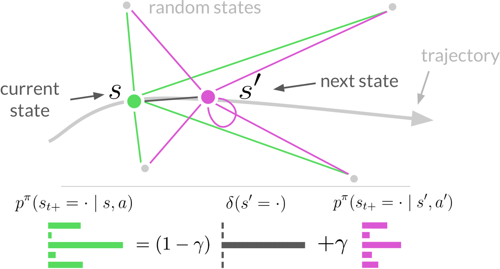

# [Contrastive Difference Predictive Coding]()
<p align="center"></p>

<p align="center"> Chongyi Zheng, &nbsp; Ruslan Salakhutdinov, &nbsp; Benjamin Eysenbach</p>
<p align="center">
    <a href="">paper</a>, <a href="https://chongyi-zheng.github.io/td_infonce">website</a>
</p>

*Abstract*: Predicting and reasoning about the future lies at the heart of many time-series questions. For example, goal-conditioned reinforcement learning can be viewed as learning representations to predict which states are likely to be visited in the future. While prior methods have used contrastive predictive coding to model time series data, learning representations that encode long-term dependencies usually requires large amounts of data. In this paper, we introduce a temporal difference version of contrastive predictive coding that stitching together pieces of different time series data to decrease the amount of data required to learn to predict future events. We apply this representation learning method to derive an off-policy algorithm for goal-conditioned RL. Experiments demonstrate that, compared with prior RL methods, ours achieves higher success rates with less data, and can better cope with stochastic environments.

This repository contains code for running TD InfoNCE algorithm.

[//]: # (```)

[//]: # (@misc{zheng2023stabilizing,)

[//]: # (      title={Stabilizing Contrastive RL: Techniques for Offline Goal Reaching}, )

[//]: # (      author={Chongyi Zheng and Benjamin Eysenbach and Homer Walke and Patrick Yin and Kuan Fang and Ruslan Salakhutdinov and Sergey Levine},)

[//]: # (      year={2023},)

[//]: # (      eprint={2306.03346},)

[//]: # (      archivePrefix={arXiv},)

[//]: # (      primaryClass={cs.LG})

[//]: # (})

[//]: # (```)

## Installation

1. Create an Anaconda environment: `conda create -n td_infonce python=3.9 -y`
2. Activate the environment: `conda activate td_infonce`
3. Install the dependencies: `pip install -r requirements.txt --no-deps`
4. Install jax with CUDA manually:
```
TODO
```
5. Export environment variables
```
export TF_FORCE_GPU_ALLOW_GROWTH=true
export XLA_PYTHON_CLIENT_PREALLOCATE=false
export PATH=$CONDA_PREFIX/bin
```


## Running experiments

Check `lp_td_infonce.py` for available tasks and specific hyperparameters. You can turn on `--debug` and `--run_tf_eagerly` to run the code in debug mode.

### Online GCRL experiments

```
python lp_td_infonce.py 
--env_name=fetch_reach
--max_number_of_steps=500_000
--seed=0
--lp_launch_type=local_mp
--exp_log_dir=LOG_DIR
```

### Offline GCRL experiments

```
python lp_td_infonce.py 
--env_name=offline_ant_umaze
--max_number_of_steps=500_000
--seed=0
--lp_launch_type=local_mp
--exp_log_dir=LOG_DIR
```

## Acknowledgement

The TD InfoNCE implementation was adapted from [contrastive RL](https://github.com/google-research/google-research/blob/master/contrastive_rl).

## Questions?
If you have any questions, comments, or suggestions, please reach out to Chongyi Zheng (chongyiz@andrew.cmu.edu).
